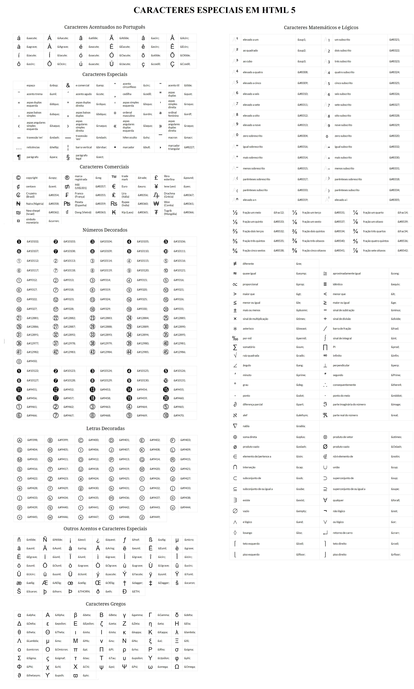

## Content
- [Conceitos](#conceitos)
- [Trabalhando com Elementos](#trabalhando-com-elementos)
- [Links](#links)
- [Tabelas](#tabelas)

## Conceitos
- [HTML](#html)
- [Comentários](#comentários)
- [Tags](#tags)
- [Atributos](#atributos)
- [Caracteres](#caracteres-reservados)
- [Documento](#documento-html)

### HTML
O que é HTML?

Hypertext Markup Language - Linguagem de marcação de hipertexto

Não é uma linguagem de programação; é uma linguagem por seu jeito de escrever, ou seja, possui semântica, sintaxe... serve para marcar textos, garante a formatação ideal para sites. Os hipertextos são aqueles que se encontram na web que permitem acesso a outros textos por meio de links.

### Comentários
Como fazer comentários no HTML?
```html
<!-- Isto é um comentário -->
```
Comentários não aparecem na página do usuário final.

### Tags
Como funcionam as tags?

A marcação do HTML é constituida por tags.

#### Anatomia das tags:
    
Abertura de tag: <*nome-da-tag*>
    
Fechamento de tag: </*nome-da-tag*>

Exemplo:
```html
  <h1>
     Conteúdo
  </h1>
 ```
 Nesse exemplo o "Conteúdo" está marcado como título.
 
 Isso é um elemento HTML, ou seja, Abertura + Conteúdo + Fechamento.
 
 Existem elementos vazios, isso significa que eles não possuem conteúdo e uma tag de fechamento.
 ```html
 <meta >
 ```

#### Aninhamento de tags
Colocar tags dentro da outra.

Errado:
```html
<p>
  Vou <em>escrever um parágrafo
</p></em>
```
Certo:
```html
<p>
  Vou <em>escrever</em> um parágrafo
</p>
```
É necessário fechar a tag anterior aberta.

#### Hierarquia
```html
<div>
  <p></p>
</div>
```
A tag p é filha da div. Todos elementos dentro da div, por exemplo, são filhos dela.

#### Fluxo
Cada tag é lida na sua ordem de aparição no documento HTML. Exemplo:
```html
<h1> oi</h1>
<p> Tudo bem?>
```
O oi aparece primeiro no site e abaixo dele vai aparecer o tudo bem.

#### Posicionamento dos elementos
Algumas tags ficarão em linha, elas não vão quebrar e ir pra próxima linha, outras tags quebram a linha porque precisam ocupar o bloco inteiro da linha. Exemplo:
```html
<p> 
  um <em>texto</em>
  <p>outro texto</p>
</p>
```
em renderiza "texto" na mesma linha já o "outro texto" fica na próxima linha e não do lado de "um texto".

 ### Atributos
 As tags HTML possuem atributos. Eles servem como informações extras pra colocar no elemento ou como configurações. Exemplo:
 ```html
 
 ```
 
 src e alt são atributos da tag img.
 
 Atributos booleanos ( true or false ) não precisam de conteúdo. Exemplo:k
 ```html
 <input type="text" disabled>
 ```
 disabled é um atributo booleano.
 
 Usar sempre aspas duplas nos atributos.
 
 #### Atributos globais
 Atributos globais são aqueles que podem ser declarados em qualquer tag HTML. Mas nem em todas as tags eles podem funcionar. Mais atributos em: https://developer.mozilla.org/pt-br/docs/Web/HTML/Global_attributes
 - Classes
 ```html
 <div class="carrinho"></div> 
```
Classes classificam o conteúdo e a mesma classe pode ser usada em vários elementos. Elas também servem para poder acessar o elemento pelo CSS ou javascript.

- Conteúdo editável
```html
<div contenteditable="true"></div>
```
Elementos com esse atributo podem ter seus conteúdos alterados na página, porém as modificações não são salvas.
- data-*
```html
<div data-qualquer-coisa=""></div>
```
O atributo data-onomequeeuquiser é muito utilizado no javascript para espandir que tipos de atributos eu posso colocar no meu HTML pra mais tarde fazer lógicas.
- Esconder
```html
<div hidden></div>
```
Os elementos com hidden ficam escondidos na página (invisíveis).
- ids
```html
<div id="name"></div>
```
Um id é como o cpf do elemento, não se pode repetir o mesmo nome de id em outros elementos. Por isso se tem a classe.
- Style
```html
<div style="color: red"></div>
```
O atributo style serve para aplicar CSS diretamente no HTML.
- tabindex
```html
<div tabindex="1"></div>
<div tabindex="2"></div>
```
O tabindex é uma forma de permitir a navegação no site através da tecla tab.
- Título
```html
<div title="algo"></div>
```
O que é definido no atributo title é o que aparece quando deixamos o mouse descansando em cima de algum elemento.

### Caracteres reservados
Para conseguir renderizar na tela caracteres como "<" que são de uso do HTML (reservados) e outros, usa-se esse tipo de coisa: 

### Documento HTML
Anatomia de um documento HTML:
```html
<!DOCTYPE html>
<html>
    <head>
    
    </head>
    <body>
    
    </body>
</html>
```
O html é sempre iniciado com "<!DOCTYPE html>" para que alguns navegadores identificarem que estamos usando html 5.

Em seguida vem o nosso html em si ( ```<html>``` ). O html possui dois importantes elementos - head e body. Na tag head colocamos configurações importantes para a página que em sua maioria não aparecem na tela. Tudo que fica na tag body aparecerá para o usuário na página.

## Trabalhando com Elementos
- [Semântica](#semantica)
- [Títulos e Parágrafos](#titulos-e-paragrafos)
- [Listas](#listas)
- [Citações](#citacoes)
- [Abreviações](#abreviações)
- [Detalhes de Contato](#detalhes-de-contato)
- [Lista de Descrição](#lista-de-descrição)
- [Representação de Código](#representação-de-codigo)
- [Elementos Genéricos](#elementos-genericos)

### Semântica
Dar significado.

Usa-se elementos semânticos. Elementos que melhor descrevem o que será feito.

Um site semântico é melhor colocado nas páginas de pesquisa. 

### Títulos e Parágrafos
<h1>Título nivel-1</h1>
<h2>Título nivel-2</h2>
<h3>Título nivel-3</h3>
<h4>Título nivel-4</h4>
<h5>Título nivel-5</h5>
<h6>Título nivel-6</h6>

```html
<h1>Título nivel-1</h1>
<h2>Título nivel-2</h2>
<h3>Título nivel-3</h3>
<h4>Título nivel-4</h4>
<h5>Título nivel-5</h5>
<h6>Título nivel-6</h6>
```
O h1 é considerado o principal da página e de preferência/geralmente se usa um dele por página.

Não precisa ter mais de 3 tipos de h por página.

### Listas
Podem ser ordenadas ou não ordenadas.

Ordenada: (com números)
```html
<ol>
    <li>1 da lista</li>
    <li>2 da lista</li>
</ol>
```
Não ordenada: (com pontos)
```html
<ul>
    <li>1 da lista</li>
    <li>2 da lista</li>
</ul>
```
